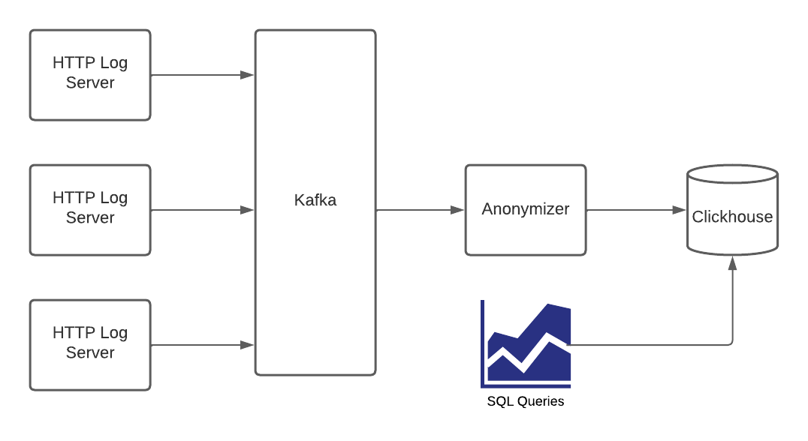

# Data Engineering Task

## Task 1 ETL (Anonymizer)

### Requirements

#### Required
* [Docker](https://docs.docker.com/engine/install/)
* [CapNProto](https://capnproto.org/install.html)

#### Recommended
* [Kafka](https://kafka.apache.org/quickstart)
* [clickhouse-client](https://clickhouse.com/docs/en/getting-started/install/)



Imagine a logging pipeline of HTTP records, data collected from edge
servers and sent to an Apache Kafka topic called `http_log` as messages. Your task consumes
those messages, performs Cap'N Proto decoding, transforms the data as needed, and inserts them
to a ClickHouse table. The Cap'N Proto schema is
[http_log.capnp](http_log.capnp).


Because of the GDPR regulations you have to anonymize the client IP. For
each record change `remoteAddr`'s last octet to X before sending it over to
ClickHouse (e.g. 1.2.3.`4` -> 1.2.3.`X`).

* Each record must be stored to ClickHouse, even in the event of network or server error. Make sure
that you handle those appropriately.
* Your application should communicate with the ClickHouse server only through the proxy which has
rate limiting for a 1 request per minute limit.
* If there are any limitation about your application write down what they are, and how would you solve them in the future.
  For example
  * What is the latency of the data?
  * Is there any scenario when you will start losing data?
  * Is it possible that there will be a stored duplicate record?
* You can implement the task in any of those languages:
  * Go
  * C/C++
  * Java
  * Rust

### SQL / ClickHouse part

Load those data into ClickHouse, using a new table called `http_log` with the following columns.

```
  timestamp DateTime
  resource_id UInt64
  bytes_sent UInt64
  request_time_milli UInt64
  response_status UInt16
  cache_status LowCardinality(String)
  method LowCardinality(String)
  remote_addr String
  url String
```

Provide a table with ready made totals of served traffic for any combination of resource ID, HTTP status,
cache status and IP address. The totals need to be queried efficiently, in seconds at best, for on-demand
rendering of traffic charts in a front-end such as Grafana.

Characterize the aggregated select query time to show the table architecture is fit for purpose.
Provide an estimate of disk space required given
 1) average incoming message rate
 2) retention of the aggregated data

### Testing environment

You can use included [docker-compose.yml](docker-compose.yml) to setup a local
development environment with every service that you will need for this task.

```bash
$ docker-compose up -d
[+] Running 10/10
 ⠿ Network data-engineering-task_default  Created   0.0s
 ⠿ Container zookeeper                    Started   0.9s
 ⠿ Container prometheus                   Started   0.8s
 ⠿ Container clickhouse                   Started   0.9s
 ⠿ Container ch-proxy                     Started   1.2s
 ⠿ Container broker                       Started   1.3s
 ⠿ Container grafana                      Started   1.2s
 ⠿ Container log-producer                 Started   1.7s
 ⠿ Container kafka-ui                     Started   1.9s
 ⠿ Container jmx-kafka                    Started   1.8s
 ```

After running `docker-compose up -d`, Kafka is available on local port 9092.
You can test it with

```bash
$ kafka-console-consumer --bootstrap-server localhost:9092 \
                         --topic http_log \
                         --group data-engineering-task-reader
```

For testing, a service called `http-log-kafka-producer` is provided, started alongside Kafka.
It produces synthetic Cap'n Proto-encoded records. You can adjust its rate of producing via the
`KAFKA_PRODUCER_DELAY_MS` environment variable inside [docker-compose.yml](./docker-compose.yml)

ClickHouse should be accessed through a proxy running on HTTP port 8124.

For convenience, [Kafka-UI](localhost:4000/) and [Grafana](localhost:3000/) are running
(user `admin` and password `kafka`) that might be useful if you run into any trouble
with Kafka.
